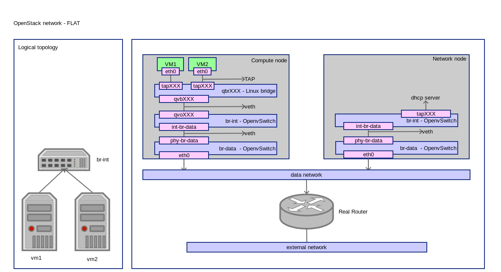

========================
OpenStack Network - FLAT
========================
:Author: Yugang LIU <liuyug@gmail.com>
:Copyright: `署名-相同方式共享 3.0 (CC BY-SA 3.0) <http://creativecommons.org/licenses/by-sa/3.0/>`_

.. section-numbering::
.. contents::

OpenStack FLAT 网络配置详解

其它相关文件请查阅 SimpleStack_

.. _SimpleStack: https://github.com/liuyug/simplestack

Configure network
----------------------
::

    sh flat_settings.sh

.. include:: flat_settings.sh
    :code: bash

Create external network
------------------------
::

    sh create_net.sh

.. include:: create_net.sh
    :code: bash

Create VM
-----------
::

    sh tools/create_vm.sh cirros01 cirros-x86_64 demo-net

connect to VM through vnc::

    nova get-vnc-console cirros01

Check network
--------------
compute node
~~~~~~~~~~~~~

ovs-vsctl show::

    1a002d63-3057-49fe-be40-44562e01a6e8
        Bridge br-data
            Port br-data
                Interface br-data
                    type: internal
            Port "eth0"
                Interface "eth0"
            Port phy-br-data
                Interface phy-br-data
        Bridge br-int
            Port br-int
                Interface br-int
                    type: internal
            Port "qvo670110e0-a8"
                tag: 1
                Interface "qvo670110e0-a8"
            Port int-br-data
                Interface int-br-data
        ovs_version: "2.0.1"

+ br-data 为 Provider Network 桥

``ip link``::

    1: lo: <LOOPBACK,UP,LOWER_UP> mtu 65536 qdisc noqueue state UNKNOWN mode DEFAULT group default 
        link/loopback 00:00:00:00:00:00 brd 00:00:00:00:00:00
    2: eth0: <BROADCAST,MULTICAST,UP,LOWER_UP> mtu 1500 qdisc pfifo_fast master ovs-system state UP mode DEFAULT group default qlen 1000
        link/ether 00:21:cc:6d:53:8d brd ff:ff:ff:ff:ff:ff
    3: wlan0: <BROADCAST,MULTICAST,UP,LOWER_UP> mtu 1500 qdisc mq state UP mode DORMANT group default qlen 1000
        link/ether 08:11:96:5e:48:d8 brd ff:ff:ff:ff:ff:ff
    4: ovs-system: <BROADCAST,MULTICAST> mtu 1500 qdisc noop state DOWN mode DEFAULT group default 
        link/ether f6:cb:38:8c:da:66 brd ff:ff:ff:ff:ff:ff
    5: br-int: <BROADCAST,UP,LOWER_UP> mtu 1500 qdisc noqueue state UNKNOWN mode DEFAULT group default 
        link/ether ba:c3:07:ae:95:46 brd ff:ff:ff:ff:ff:ff
    7: virbr0: <NO-CARRIER,BROADCAST,MULTICAST,UP> mtu 1500 qdisc noqueue state DOWN mode DEFAULT group default 
        link/ether 6a:9f:ac:1d:cd:3a brd ff:ff:ff:ff:ff:ff
    24: br-data: <BROADCAST,UP,LOWER_UP> mtu 1500 qdisc noqueue state UNKNOWN mode DEFAULT group default 
        link/ether 00:21:cc:6d:53:8d brd ff:ff:ff:ff:ff:ff
    39: phy-br-data: <BROADCAST,MULTICAST,UP,LOWER_UP> mtu 1500 qdisc pfifo_fast master ovs-system state UP mode DEFAULT group default qlen 1000
        link/ether 2a:b8:e9:f5:42:5e brd ff:ff:ff:ff:ff:ff
    40: int-br-data: <BROADCAST,MULTICAST,UP,LOWER_UP> mtu 1500 qdisc pfifo_fast master ovs-system state UP mode DEFAULT group default qlen 1000
        link/ether f6:5a:4a:3b:43:dc brd ff:ff:ff:ff:ff:ff
    41: qbr670110e0-a8: <BROADCAST,MULTICAST,UP,LOWER_UP> mtu 1500 qdisc noqueue state UP mode DEFAULT group default 
        link/ether 9e:68:52:c6:2f:a9 brd ff:ff:ff:ff:ff:ff
    42: qvo670110e0-a8: <BROADCAST,MULTICAST,PROMISC,UP,LOWER_UP> mtu 1500 qdisc pfifo_fast master ovs-system state UP mode DEFAULT group default qlen 1000
        link/ether 1e:8a:f6:f4:0c:92 brd ff:ff:ff:ff:ff:ff
    43: qvb670110e0-a8: <BROADCAST,MULTICAST,PROMISC,UP,LOWER_UP> mtu 1500 qdisc pfifo_fast master qbr670110e0-a8 state UP mode DEFAULT group default qlen 1000
        link/ether 9e:68:52:c6:2f:a9 brd ff:ff:ff:ff:ff:ff
    47: tap670110e0-a8: <BROADCAST,MULTICAST,UP,LOWER_UP> mtu 1500 qdisc pfifo_fast master qbr670110e0-a8 state UNKNOWN mode DEFAULT group default qlen 500
        link/ether fe:16:3e:44:c6:f3 brd ff:ff:ff:ff:ff:ff

``brctl show``::

    ridge name	bridge id		STP enabled	interfaces
    qbr670110e0-a8		8000.9e6852c62fa9	no		qvb670110e0-a8
                                tap670110e0-a8

``virsh list``::

     Id    Name                           State
    ----------------------------------------------------
     2     instance-0000004c              running

``virsh dumpxml instance-0000004c | grep tap``::

      <target dev='tap670110e0-a8'/>

+ VM 使用接口 tap670110e0-a8
+ tap670110e0-a8 和 qvb670110e0-a8 在桥 qbr670110e0-a8 里

``ethtool -S qvb670110e0-a8``::

    NIC statistics:
         peer_ifindex: 42

    # from ip link
    # 42: qvo670110e0-a8: <BROADCAST,MULTICAST,PROMISC,UP,LOWER_UP> mtu 1500 qdisc pfifo_fast master ovs-system state UP mode DEFAULT group default qlen 1000
        link/ether 1e:8a:f6:f4:0c:92 brd ff:ff:ff:ff:ff:ff

``ethtool -S qvo670110e0-a8``::

    NIC statistics:
         peer_ifindex: 43

    # from ip link
    # 43: qvb670110e0-a8: <BROADCAST,MULTICAST,PROMISC,UP,LOWER_UP> mtu 1500 qdisc pfifo_fast master qbr670110e0-a8 state UP mode DEFAULT group default qlen 1000
        link/ether 9e:68:52:c6:2f:a9 brd ff:ff:ff:ff:ff:ff

+ qvb670110e0-a8 和 qvo670110e0-a8 是一对 veth

``ethtool -S int-br-data``::

    NIC statistics:
         peer_ifindex: 39

    # 39: phy-br-data: <BROADCAST,MULTICAST,UP,LOWER_UP> mtu 1500 qdisc pfifo_fast master ovs-system state UP mode DEFAULT group default qlen 1000
        link/ether 2a:b8:e9:f5:42:5e brd ff:ff:ff:ff:ff:ff

``ethtool -S phy-br-data``::

    NIC statistics:
         peer_ifindex: 40

    # 40: int-br-data: <BROADCAST,MULTICAST,UP,LOWER_UP> mtu 1500 qdisc pfifo_fast master ovs-system state UP mode DEFAULT group default qlen 1000
        link/ether f6:5a:4a:3b:43:dc brd ff:ff:ff:ff:ff:ff

+ int-br-data 和 phy-br-data 是一对 veth
+ qvo670110e0-a8 通过 int-br-data, phy-br-data 到达 br-data
+ br-data 通过 eth0 到达网络节点的 br-data

network node
~~~~~~~~~~~~~

``ovs-vsctl show``::

    8108a40e-292b-4ed0-80c1-23fc08aacd3d
        Bridge br-data
            Port br-data
                Interface br-data
                    type: internal
            Port "eth0"
                Interface "eth0"
            Port phy-br-data
                Interface phy-br-data
        Bridge br-int
            Port int-br-data
                Interface int-br-data
            Port br-int
                Interface br-int
                    type: internal
            Port "tap0d6086f2-ff"
                tag: 1
                Interface "tap0d6086f2-ff"
                    type: internal
        ovs_version: "2.0.1"

+ int-br-data 和 phy-br-data 是一对 veth
+ br-int 通过 int-br-data, phy-br-data 到达 br-data

``ip netns``::

    qdhcp-b1b8d6a5-f9ce-4e33-b603-a1dd11015eea

+ FLAT 网络没有虚拟路由

``ip netns exec qdhcp-b1b8d6a5-f9ce-4e33-b603-a1dd11015eea ip addr``::

    1: lo: <LOOPBACK,UP,LOWER_UP> mtu 65536 qdisc noqueue state UNKNOWN group default 
        link/loopback 00:00:00:00:00:00 brd 00:00:00:00:00:00
        inet 127.0.0.1/8 scope host lo
           valid_lft forever preferred_lft forever
        inet6 ::1/128 scope host 
           valid_lft forever preferred_lft forever
    34: tap0d6086f2-ff: <BROADCAST,UP,LOWER_UP> mtu 1500 qdisc noqueue state UNKNOWN group default 
        link/ether fa:16:3e:8f:fb:f3 brd ff:ff:ff:ff:ff:ff
        inet 192.168.100.151/24 brd 192.168.100.255 scope global tap0d6086f2-ff
           valid_lft forever preferred_lft forever
        inet 169.254.169.254/16 brd 169.254.255.255 scope global tap0d6086f2-ff
           valid_lft forever preferred_lft forever
        inet6 fe80::f816:3eff:fe8f:fbf3/64 scope link 
           valid_lft forever preferred_lft forever

+ dhcp 上接口上有 2 个 IP，192.168.100.151 和 169.254.169.254

``ip netns exec qdhcp-b1b8d6a5-f9ce-4e33-b603-a1dd11015eea netstat -tunlp``::

    Active Internet connections (only servers)
    Proto Recv-Q Send-Q Local Address           Foreign Address         State       PID/Program name
    tcp        0      0 0.0.0.0:80              0.0.0.0:*               LISTEN      29381/python    
    tcp        0      0 192.168.100.151:53      0.0.0.0:*               LISTEN      29554/dnsmasq   
    tcp        0      0 169.254.169.254:53      0.0.0.0:*               LISTEN      29554/dnsmasq   
    tcp6       0      0 fe80::f816:3eff:fe8f:53 :::*                    LISTEN      29554/dnsmasq   
    udp        0      0 192.168.100.151:53      0.0.0.0:*                           29554/dnsmasq   
    udp        0      0 169.254.169.254:53      0.0.0.0:*                           29554/dnsmasq   
    udp        0      0 0.0.0.0:67              0.0.0.0:*                           29554/dnsmasq   
    udp6       0      0 fe80::f816:3eff:fe8f:53 :::*                                29554/dnsmasq   

``ps -ef |grep 29554``::

    nobody   29554     1  0 09:45 ?        00:00:00 dnsmasq --no-hosts --no-resolv --strict-order --bind-interfaces --interface=tap0d6086f2-ff --except-interface=lo --pid-file=/var/lib/neutron/dhcp/b1b8d6a5-f9ce-4e33-b603-a1dd11015eea/pid --dhcp-hostsfile=/var/lib/neutron/dhcp/b1b8d6a5-f9ce-4e33-b603-a1dd11015eea/host --addn-hosts=/var/lib/neutron/dhcp/b1b8d6a5-f9ce-4e33-b603-a1dd11015eea/addn_hosts --dhcp-optsfile=/var/lib/neutron/dhcp/b1b8d6a5-f9ce-4e33-b603-a1dd11015eea/opts --leasefile-ro --dhcp-range=set:tag0,192.168.100.0,static,86400s --dhcp-lease-max=256 --conf-file= --domain=openstacklocal
    root     31234 26413  0 10:11 pts/7    00:00:00 grep --color=auto 29554

+ tap0d6086f2-ff 接口上是 DHCP 服务

``ps -ef |grep 29381``::

    root     29381     1  0 09:43 ?        00:00:00 /usr/bin/python /usr/bin/neutron-ns-metadata-proxy --pid_file=/var/lib/neutron/external/pids/b1b8d6a5-f9ce-4e33-b603-a1dd11015eea.pid --metadata_proxy_socket=/var/lib/neutron/metadata_proxy --network_id=b1b8d6a5-f9ce-4e33-b603-a1dd11015eea --state_path=/var/lib/neutron --metadata_port=80 --verbose --log-file=neutron-ns-metadata-proxy-b1b8d6a5-f9ce-4e33-b603-a1dd11015eea.log --log-dir=/var/log/neutron
    root     31312 26413  0 10:12 pts/7    00:00:00 grep --color=auto 29381

+ 80 端口提供 Neutron meatdata 服务

VM
~~~~
``ip route``::

    default via 192.168.100.1 dev eth0 
    169.254.169.254 via 192.168.100.151 dev eth0 
    192.168.100.0/24 dev eth0  src 192.168.100.150 

+ DHCP 服务注入 169.254.169.254 路由，
+ 192.168.100.151 是 DHCP 节点，并拥有地址 169.254.169.254，提供 metadata 服务

OpenFlow
~~~~~~~~~
``ovs-ofctl dump-flows br-int``::

    NXST_FLOW reply (xid=0x4):
     cookie=0x0, duration=60707.969s, table=0, n_packets=412, n_bytes=33330, idle_age=2789, priority=3,in_port=6,vlan_tci=0x0000 actions=mod_vlan_vid:1,NORMAL
     cookie=0x0, duration=60805.188s, table=0, n_packets=8, n_bytes=648, idle_age=60795, priority=2,in_port=6 actions=drop
     cookie=0x0, duration=60805.896s, table=0, n_packets=132, n_bytes=14877, idle_age=2789, priority=1 actions=NORMAL

+ 从 port 6 进入，加上 vlan1 标记
+ br-int 上 接口 tag 是 1

``ovs-ofctl dump-flows br-data``::

    NXST_FLOW reply (xid=0x4):
     cookie=0x0, duration=60773.926s, table=0, n_packets=125, n_bytes=14387, idle_age=2855, priority=4,in_port=5,dl_vlan=1 actions=strip_vlan,NORMAL
     cookie=0x0, duration=60871.034s, table=0, n_packets=15, n_bytes=1246, idle_age=60773, priority=2,in_port=5 actions=drop
     cookie=0x0, duration=60871.651s, table=0, n_packets=99034, n_bytes=16893780, idle_age=0, priority=1 actions=NORMAL

+ 从 port 5进入，去除 vlan1 标记
+ br-data 上是普通 IP 包

