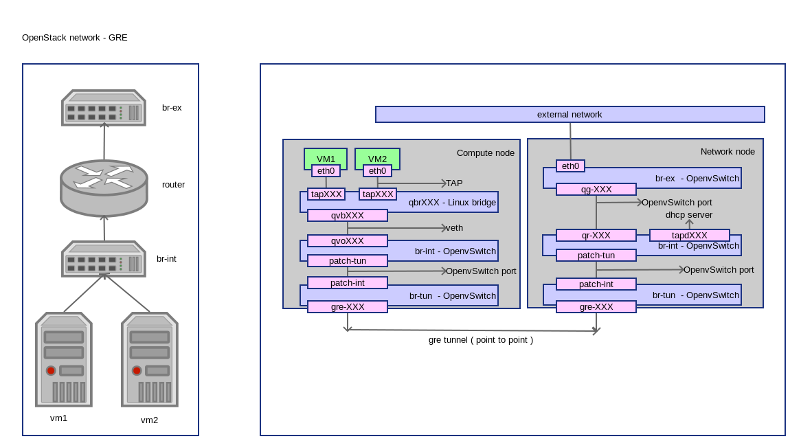

OpenStack Network - GRE
========================
:Author: Yugang LIU <liuyug@gmail.com>
:Copyright: `署名-相同方式共享 3.0 (CC BY-SA 3.0) <http://creativecommons.org/licenses/by-sa/3.0/>`_

OpenStack GRE 网络配置详解

其它相关文件请查阅我的 SimpleStack_

.. _SimpleStack: https://github.com/liuyug/simplestack

Configure GRE network
----------------------
::

    sh gre_settings.sh

.. include:: gre_settings.sh
    :code: bash

Create external network
------------------------
::

    sh create_ext-net.sh

.. include:: create_ext-net.sh
    :code: bash

Create internal network
------------------------
::

    sh create_int-net.sh

.. include:: create_int-net.sh
    :code: bash

Create VM
-----------
::

    sh tools/create_vm.sh cirros01 cirros-x86_64 demo-net

    nova get-vnc-console cirros01

Check network
--------------
On compute node:

ovs-vsctl show::

    1a002d63-3057-49fe-be40-44562e01a6e8
        Bridge br-int
            Port "qvo615add81-37"
                tag: 1
                Interface "qvo615add81-37"
            Port br-int
                Interface br-int
                    type: internal
            Port patch-tun
                Interface patch-tun
                    type: patch
                    options: {peer=patch-int}
        Bridge br-tun
            Port br-tun
                Interface br-tun
                    type: internal
            Port patch-int
                Interface patch-int
                    type: patch
                    options: {peer=patch-tun}
            Port "gre-096f39fb"
                Interface "gre-096f39fb"
                    type: gre
                    options: {in_key=flow, local_ip="192.168.1.250", out_key=flow, remote_ip="192.168.1.251"}
        ovs_version: "2.0.1"

``ip link``::

    1: lo: <LOOPBACK,UP,LOWER_UP> mtu 65536 qdisc noqueue state UNKNOWN mode DEFAULT group default 
        link/loopback 00:00:00:00:00:00 brd 00:00:00:00:00:00
    2: eth0: <BROADCAST,MULTICAST,UP,LOWER_UP> mtu 1500 qdisc pfifo_fast state UP mode DEFAULT group default qlen 1000
        link/ether 00:21:cc:6d:53:8d brd ff:ff:ff:ff:ff:ff
    3: wlan0: <BROADCAST,MULTICAST> mtu 1500 qdisc noop state DOWN mode DEFAULT group default qlen 1000
        link/ether 08:11:96:5e:48:d8 brd ff:ff:ff:ff:ff:ff
    4: ovs-system: <BROADCAST,MULTICAST> mtu 1500 qdisc noop state DOWN mode DEFAULT group default 
        link/ether 3e:4b:8a:b4:83:aa brd ff:ff:ff:ff:ff:ff
    7: virbr0: <NO-CARRIER,BROADCAST,MULTICAST,UP> mtu 1500 qdisc noqueue state DOWN mode DEFAULT group default 
        link/ether aa:5b:68:49:b3:cd brd ff:ff:ff:ff:ff:ff
    9: br-int: <BROADCAST,UP,LOWER_UP> mtu 1500 qdisc noqueue state UNKNOWN mode DEFAULT group default 
        link/ether ba:c3:07:ae:95:46 brd ff:ff:ff:ff:ff:ff
    13: br-tun: <BROADCAST,UP,LOWER_UP> mtu 1500 qdisc noqueue state UNKNOWN mode DEFAULT group default 
        link/ether 06:83:d9:f6:34:4e brd ff:ff:ff:ff:ff:ff
    14: qbr615add81-37: <BROADCAST,MULTICAST,UP,LOWER_UP> mtu 1500 qdisc noqueue state UP mode DEFAULT group default 
        link/ether 1e:c1:2c:1b:ac:8f brd ff:ff:ff:ff:ff:ff
    15: qvo615add81-37: <BROADCAST,MULTICAST,PROMISC,UP,LOWER_UP> mtu 1500 qdisc pfifo_fast master ovs-system state UP mode DEFAULT group default qlen 1000
        link/ether d6:a5:00:dd:38:97 brd ff:ff:ff:ff:ff:ff
    16: qvb615add81-37: <BROADCAST,MULTICAST,PROMISC,UP,LOWER_UP> mtu 1500 qdisc pfifo_fast master qbr615add81-37 state UP mode DEFAULT group default qlen 1000
        link/ether 1e:c1:2c:1b:ac:8f brd ff:ff:ff:ff:ff:ff
    17: tap615add81-37: <BROADCAST,MULTICAST,UP,LOWER_UP> mtu 1500 qdisc pfifo_fast master qbr615add81-37 state UNKNOWN mode DEFAULT group default qlen 500
        link/ether fe:16:3e:3a:cd:25 brd ff:ff:ff:ff:ff:ff

``brctl show``::

    bridge name	bridge id		STP enabled	interfaces
    qbr615add81-37		8000.1ec12c1bac8f	no		qvb615add81-37
                                tap615add81-37

``virsh list``::

     Id    Name                           State
    ----------------------------------------------------
     2     instance-00000042              running

``virsh dumpxml instance-00000042 | grep tap``::

      <target dev='tap615add81-37'/>

+ VM 使用接口 tap615add81-37
+ tap615add81-37 和 qvb615add81-37 在桥 qbr615add81-37 里

``ethtool -S qvb615add81-37``::

    NIC statistics:
         peer_ifindex: 15

    # from ip link
    # 15: qvo615add81-37: <BROADCAST,MULTICAST,PROMISC,UP,LOWER_UP> mtu 1500 qdisc pfifo_fast master ovs-system state UP mode DEFAULT group default qlen 1000

``ethtool -S qvo615add81-37``::

    NIC statistics:
         peer_ifindex: 16

    # from ip link
    # 16: qvb615add81-37: <BROADCAST,MULTICAST,PROMISC,UP,LOWER_UP> mtu 1500 qdisc pfifo_fast master qbr615add81-37 state UP mode DEFAULT group default qlen 1000         link/ether 1e:c1:2c:1b:ac:8f brd ff:ff:ff:ff:ff:ff

+ qvb615add81-37 和 qvo615add81-37 是一对 veth
+ qvo615add81-37 通过 patch-tun, patch-int 到达 br-tun
+ br-tun 通过 gre-096f39fb, gre-096f39fa 到达网络节点的 br-tun

On network node:

``ovs-vsctl show``::

    8108a40e-292b-4ed0-80c1-23fc08aacd3d
        Bridge br-tun
            Port "gre-096f39fa"
                Interface "gre-096f39fa"
                    type: gre
                    options: {in_key=flow, local_ip="192.168.1.251", out_key=flow, remote_ip="192.168.1.250"}
            Port patch-int
                Interface patch-int
                    type: patch
                    options: {peer=patch-tun}
            Port br-tun
                Interface br-tun
                    type: internal
        Bridge br-int
            Port "qr-a45cd9b5-4b"
                tag: 1
                Interface "qr-a45cd9b5-4b"
                    type: internal
            Port "tapd43ed2ed-5a"
                tag: 1
                Interface "tapd43ed2ed-5a"
                    type: internal
            Port patch-tun
                Interface patch-tun
                    type: patch
                    options: {peer=patch-int}
            Port br-int
                Interface br-int
                    type: internal
        Bridge br-ex
            Port br-ex
                Interface br-ex
                    type: internal
            Port "qg-0baef12f-d3"
                Interface "qg-0baef12f-d3"
                    type: internal
            Port "eth0"
                Interface "eth0"
        ovs_version: "2.0.1"

``ip netns exec qdhcp-86fbb659-f59b-4a48-86e8-efdf74491678 ip link``::

    1: lo: <LOOPBACK,UP,LOWER_UP> mtu 65536 qdisc noqueue state UNKNOWN mode DEFAULT group default 
        link/loopback 00:00:00:00:00:00 brd 00:00:00:00:00:00
    107: tapd43ed2ed-5a: <BROADCAST,UP,LOWER_UP> mtu 1500 qdisc noqueue state UNKNOWN mode DEFAULT group default 
        link/ether fa:16:3e:cc:94:a1 brd ff:ff:ff:ff:ff:ff

``ps -ef | grep dns``::

    root      5743 19339  0 14:22 pts/0    00:00:00 grep --color=auto dns
    nobody   29916     1  0 12:07 ?        00:00:00 dnsmasq --no-hosts --no-resolv --strict-order --bind-interfaces --interface=tapd43ed2ed-5a --except-interface=lo --pid-file=/var/lib/neutron/dhcp/86fbb659-f59b-4a48-86e8-efdf74491678/pid --dhcp-hostsfile=/var/lib/neutron/dhcp/86fbb659-f59b-4a48-86e8-efdf74491678/host --addn-hosts=/var/lib/neutron/dhcp/86fbb659-f59b-4a48-86e8-efdf74491678/addn_hosts --dhcp-optsfile=/var/lib/neutron/dhcp/86fbb659-f59b-4a48-86e8-efdf74491678/opts --leasefile-ro --dhcp-range=set:tag0,10.0.1.0,static,86400s --dhcp-lease-max=16 --conf-file= --domain=openstacklocal

+ tapd43ed2ed-5a 接口上是 DHCP 服务

``ip netns exec qrouter-59d2cc28-b4ab-4c54-9208-7fb899445278 ip link``::

    1: lo: <LOOPBACK,UP,LOWER_UP> mtu 65536 qdisc noqueue state UNKNOWN mode DEFAULT group default 
        link/loopback 00:00:00:00:00:00 brd 00:00:00:00:00:00
    105: qr-a45cd9b5-4b: <BROADCAST,UP,LOWER_UP> mtu 1500 qdisc noqueue state UNKNOWN mode DEFAULT group default 
        link/ether fa:16:3e:76:78:d1 brd ff:ff:ff:ff:ff:ff
    106: qg-0baef12f-d3: <BROADCAST,UP,LOWER_UP> mtu 1500 qdisc noqueue state UNKNOWN mode DEFAULT group default 
        link/ether fa:16:3e:a2:79:9e brd ff:ff:ff:ff:ff:ff

``ip netns exec qrouter-59d2cc28-b4ab-4c54-9208-7fb899445278 ip route``::

    default via 192.168.1.1 dev qg-0baef12f-d3 
    192.168.1.0/24 dev qg-0baef12f-d3  proto kernel  scope link  src 192.168.1.245
    10.0.1.0/28 dev qr-a45cd9b5-4b  proto kernel  scope link  src 10.0.1.1 

+ qr-XXX 和 qg-XXX 两个接口被路由

``ip netns exec qrouter-59d2cc28-b4ab-4c54-9208-7fb899445278 iptables -S``::

    -P INPUT ACCEPT
    -P FORWARD ACCEPT
    -P OUTPUT ACCEPT
    -N neutron-filter-top
    -N neutron-l3-agent-FORWARD
    -N neutron-l3-agent-INPUT
    -N neutron-l3-agent-OUTPUT
    -N neutron-l3-agent-local
    -A INPUT -j neutron-l3-agent-INPUT
    -A FORWARD -j neutron-filter-top
    -A FORWARD -j neutron-l3-agent-FORWARD
    -A OUTPUT -j neutron-filter-top
    -A OUTPUT -j neutron-l3-agent-OUTPUT
    -A neutron-filter-top -j neutron-l3-agent-local
    -A neutron-l3-agent-INPUT -d 127.0.0.1/32 -p tcp -m tcp --dport 9697 -j ACCEPT

``ip netns exec qrouter-59d2cc28-b4ab-4c54-9208-7fb899445278 iptables -t nat -S``::

    -P PREROUTING ACCEPT
    -P INPUT ACCEPT
    -P OUTPUT ACCEPT
    -P POSTROUTING ACCEPT
    -N neutron-l3-agent-OUTPUT
    -N neutron-l3-agent-POSTROUTING
    -N neutron-l3-agent-PREROUTING
    -N neutron-l3-agent-float-snat
    -N neutron-l3-agent-snat
    -N neutron-postrouting-bottom
    -A PREROUTING -j neutron-l3-agent-PREROUTING
    -A OUTPUT -j neutron-l3-agent-OUTPUT
    -A POSTROUTING -j neutron-l3-agent-POSTROUTING
    -A POSTROUTING -j neutron-postrouting-bottom
    -A neutron-l3-agent-POSTROUTING ! -i qg-0baef12f-d3 ! -o qg-0baef12f-d3 -m conntrack ! --ctstate DNAT -j ACCEPT
    -A neutron-l3-agent-PREROUTING -d 169.254.169.254/32 -p tcp -m tcp --dport 80 -j REDIRECT --to-ports 9697
    -A neutron-l3-agent-snat -j neutron-l3-agent-float-snat
    -A neutron-l3-agent-snat -s 10.0.1.0/28 -j SNAT --to-source 192.168.1.245
    -A neutron-postrouting-bottom -j neutron-l3-agent-snat

+ 访问 169.254.169.254:80 将被转发到 169.254.169.254:9697
+ 从 10.0.1.0 出发的包，源地址变成 192.168.1.245。VM 通过地址转换可以访问外网

``ip netns exec qrouter-59d2cc28-b4ab-4c54-9208-7fb899445278 netstat -tunlp``::

    Active Internet connections (only servers)
    Proto Recv-Q Send-Q Local Address           Foreign Address         State       PID/Program name
    tcp        0      0 0.0.0.0:9697            0.0.0.0:*               LISTEN      27510/python    

``ps -ef | grep 27510``::

    root      5380 19339  0 14:16 pts/0    00:00:00 grep --color=auto 27510
    root     27510     1  0 11:32 ?        00:00:00 /usr/bin/python /usr/bin/neutron-ns-metadata-proxy --pid_file=/var/lib/neutron/external/pids/59d2cc28-b4ab-4c54-9208-7fb899445278.pid --metadata_proxy_socket=/var/lib/neutron/metadata_proxy --router_id=59d2cc28-b4ab-4c54-9208-7fb899445278 --state_path=/var/lib/neutron --metadata_port=9697 --verbose --log-file=neutron-ns-metadata-proxy-59d2cc28-b4ab-4c54-9208-7fb899445278.log --log-dir=/var/log/neutron

+ 9697 端口是 Neutron Metadata agent
