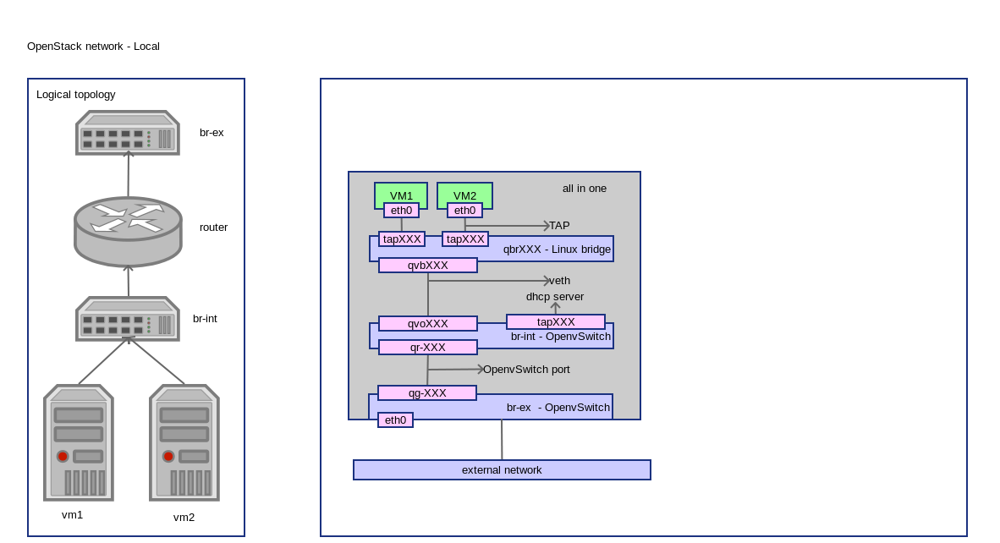

OpenStack Network - Local
==========================
:Author: Yugang LIU <liuyug@gmail.com>
:Copyright: `署名-相同方式共享 3.0 (CC BY-SA 3.0) <http://creativecommons.org/licenses/by-sa/3.0/>`_

.. section-numbering::
.. contents::

OpenStack Local 网络配置详解

其它相关文件请查阅我的 SimpleStack_

.. _SimpleStack: https://github.com/liuyug/simplestack

Configure network
----------------------
::

    sh local_settings.sh

.. include:: local_settings.sh
    :code: bash

Create external network
------------------------
::

    sh create_ext-net.sh

.. include:: create_ext-net.sh
    :code: bash

Create internal network
------------------------
::

    sh create_int-net.sh

.. include:: create_int-net.sh
    :code: bash

Create VM
-----------
::

    sh tools/create_vm.sh cirros01 cirros-x86_64 demo-net

connect to VM through vnc::

    nova get-vnc-console cirros01

Check network
--------------
compute node
~~~~~~~~~~~~~~

ovs-vsctl show::

    20add6c1-a16c-4227-982b-52dad4261a5b
        Bridge br-int
            Port "qvo7bfa2daa-66"
                tag: 2
                Interface "qvo7bfa2daa-66"
            Port "qr-cbfa75fd-e1"
                tag: 2
                Interface "qr-cbfa75fd-e1"
                    type: internal
            Port "tapa042dd0d-97"
                tag: 2
                Interface "tapa042dd0d-97"
                    type: internal
            Port br-int
                Interface br-int
                    type: internal
        Bridge br-ex
            Port br-ex
                Interface br-ex
                    type: internal
            Port "qg-c5ab6a1c-f1"
                Interface "qg-c5ab6a1c-f1"
                    type: internal
            Port "eth0"
                Interface "eth0"
        ovs_version: "2.0.1"

``ip link``::

    1: lo: <LOOPBACK,UP,LOWER_UP> mtu 65536 qdisc noqueue state UNKNOWN mode DEFAULT group default 
        link/loopback 00:00:00:00:00:00 brd 00:00:00:00:00:00
    2: eth0: <BROADCAST,MULTICAST,UP,LOWER_UP> mtu 1500 qdisc pfifo_fast master ovs-system state UP mode DEFAULT group default qlen 1000
        link/ether 00:26:2d:fe:da:fc brd ff:ff:ff:ff:ff:ff
    3: wlan0: <BROADCAST,MULTICAST> mtu 1500 qdisc noop state DOWN mode DEFAULT group default qlen 1000
        link/ether 00:23:14:79:c7:b4 brd ff:ff:ff:ff:ff:ff
    4: ovs-system: <BROADCAST,MULTICAST> mtu 1500 qdisc noop state DOWN mode DEFAULT group default 
        link/ether f2:c9:24:ce:b6:13 brd ff:ff:ff:ff:ff:ff
    5: br-ex: <BROADCAST,UP,LOWER_UP> mtu 1500 qdisc noqueue state UNKNOWN mode DEFAULT group default 
        link/ether 00:26:2d:fe:da:fc brd ff:ff:ff:ff:ff:ff
    6: br-int: <BROADCAST,UP,LOWER_UP> mtu 1500 qdisc noqueue state UNKNOWN mode DEFAULT group default 
        link/ether d2:13:d2:3b:79:4a brd ff:ff:ff:ff:ff:ff
    7: virbr0: <NO-CARRIER,BROADCAST,MULTICAST,UP> mtu 1500 qdisc noqueue state DOWN mode DEFAULT group default 
        link/ether 92:1d:26:a8:fa:37 brd ff:ff:ff:ff:ff:ff
    23: qbr7bfa2daa-66: <BROADCAST,MULTICAST,UP,LOWER_UP> mtu 1500 qdisc noqueue state UP mode DEFAULT group default 
        link/ether 32:ba:59:e0:15:06 brd ff:ff:ff:ff:ff:ff
    24: qvo7bfa2daa-66: <BROADCAST,MULTICAST,PROMISC,UP,LOWER_UP> mtu 1500 qdisc pfifo_fast master ovs-system state UP mode DEFAULT group default qlen 1000
        link/ether ce:6a:49:bf:59:d3 brd ff:ff:ff:ff:ff:ff
    25: qvb7bfa2daa-66: <BROADCAST,MULTICAST,PROMISC,UP,LOWER_UP> mtu 1500 qdisc pfifo_fast master qbr7bfa2daa-66 state UP mode DEFAULT group default qlen 1000
        link/ether 32:ba:59:e0:15:06 brd ff:ff:ff:ff:ff:ff
    26: tap7bfa2daa-66: <BROADCAST,MULTICAST,UP,LOWER_UP> mtu 1500 qdisc pfifo_fast master qbr7bfa2daa-66 state UNKNOWN mode DEFAULT group default qlen 500
        link/ether fe:16:3e:5f:1f:58 brd ff:ff:ff:ff:ff:ff

``brctl show``::

    bridge name	bridge id		STP enabled	interfaces
    qbr7bfa2daa-66		8000.32ba59e01506	no		qvb7bfa2daa-66
                                tap7bfa2daa-66

``virsh list``::

     Id    Name                           State
    ----------------------------------------------------
     2     instance-00000007              running

``virsh dumpxml instance-00000007 | grep tap``::

      <target dev='tap7bfa2daa-66'/>

+ VM 使用接口 tap7bfa2daa-66
+ tap7bfa2daa-66 和 qvb7bfa2daa-66 在桥 qbr7bfa2daa-66 里

``ethtool -S qvb7bfa2daa-66``::

    NIC statistics:
         peer_ifindex: 24

    # from ip link
    # 24: qvo7bfa2daa-66: <BROADCAST,MULTICAST,PROMISC,UP,LOWER_UP> mtu 1500 qdisc pfifo_fast master ovs-system state UP mode DEFAULT group default qlen 1000
        link/ether ce:6a:49:bf:59:d3 brd ff:ff:ff:ff:ff:ff

``ethtool -S qvo7bfa2daa-66``::

    NIC statistics:
         peer_ifindex: 25

    # from ip link
    # 25: qvb7bfa2daa-66: <BROADCAST,MULTICAST,PROMISC,UP,LOWER_UP> mtu 1500 qdisc pfifo_fast master qbr7bfa2daa-66 state UP mode DEFAULT group default qlen 1000
        link/ether 32:ba:59:e0:15:06 brd ff:ff:ff:ff:ff:ff

+ qvb7bfa2daa-66 和 qvo7bfa2daa-66 是一对 veth
+ qvo7bfa2daa-66 在 br-int 里

``ip netns``::

    qdhcp-5f2ffda1-76da-427e-b3c1-4bfc088cfb75
    qrouter-7052699b-ed8d-48a0-8365-50ac54017dfc

``ip netns exec qdhcp-5f2ffda1-76da-427e-b3c1-4bfc088cfb75 ip link``::

    1: lo: <LOOPBACK,UP,LOWER_UP> mtu 65536 qdisc noqueue state UNKNOWN mode DEFAULT group default 
        link/loopback 00:00:00:00:00:00 brd 00:00:00:00:00:00
    22: tapa042dd0d-97: <BROADCAST,UP,LOWER_UP> mtu 1500 qdisc noqueue state UNKNOWN mode DEFAULT group default 
        link/ether fa:16:3e:d3:3f:64 brd ff:ff:ff:ff:ff:ff

``ps -ef | grep dns``::

    nobody    6390     1  0 09:11 ?        00:00:00 dnsmasq --no-hosts --no-resolv --strict-order --bind-interfaces --interface=tapa042dd0d-97 --except-interface=lo --pid-file=/var/lib/neutron/dhcp/5f2ffda1-76da-427e-b3c1-4bfc088cfb75/pid --dhcp-hostsfile=/var/lib/neutron/dhcp/5f2ffda1-76da-427e-b3c1-4bfc088cfb75/host --addn-hosts=/var/lib/neutron/dhcp/5f2ffda1-76da-427e-b3c1-4bfc088cfb75/addn_hosts --dhcp-optsfile=/var/lib/neutron/dhcp/5f2ffda1-76da-427e-b3c1-4bfc088cfb75/opts --leasefile-ro --dhcp-range=set:tag0,10.0.1.0,static,86400s --dhcp-lease-max=16 --conf-file= --domain=openstacklocal
    root      7797  3390  0 10:00 pts/0    00:00:00 grep --color=auto dns

+ tapa042dd0d-97 接口上是 DHCP 服务

``ip netns exec qrouter-7052699b-ed8d-48a0-8365-50ac54017dfc ip link``::

    1: lo: <LOOPBACK,UP,LOWER_UP> mtu 65536 qdisc noqueue state UNKNOWN mode DEFAULT group default 
        link/loopback 00:00:00:00:00:00 brd 00:00:00:00:00:00
    20: qr-cbfa75fd-e1: <BROADCAST,UP,LOWER_UP> mtu 1500 qdisc noqueue state UNKNOWN mode DEFAULT group default 
        link/ether fa:16:3e:7f:af:47 brd ff:ff:ff:ff:ff:ff
    21: qg-c5ab6a1c-f1: <BROADCAST,UP,LOWER_UP> mtu 1500 qdisc noqueue state UNKNOWN mode DEFAULT group default 
        link/ether fa:16:3e:61:7b:20 brd ff:ff:ff:ff:ff:ff

``ip netns exec qrouter-7052699b-ed8d-48a0-8365-50ac54017dfc ip route``::

    default via 192.168.1.1 dev qg-c5ab6a1c-f1 
    192.168.1.0/24 dev qg-c5ab6a1c-f1  proto kernel  scope link  src 192.168.1.245 
    10.0.1.0/28 dev qr-cbfa75fd-e1  proto kernel  scope link  src 10.0.1.1 

+ qr-XXX 和 qg-XXX 两个接口被路由
+ br-int 通过 qr-XXX, qg-XXX 路由到 br-ex

``ip netns exec qrouter-7052699b-ed8d-48a0-8365-50ac54017dfc iptables -S``::

    -P INPUT ACCEPT
    -P FORWARD ACCEPT
    -P OUTPUT ACCEPT
    -N neutron-filter-top
    -N neutron-l3-agent-FORWARD
    -N neutron-l3-agent-INPUT
    -N neutron-l3-agent-OUTPUT
    -N neutron-l3-agent-local
    -A INPUT -j neutron-l3-agent-INPUT
    -A FORWARD -j neutron-filter-top
    -A FORWARD -j neutron-l3-agent-FORWARD
    -A OUTPUT -j neutron-filter-top
    -A OUTPUT -j neutron-l3-agent-OUTPUT
    -A neutron-filter-top -j neutron-l3-agent-local
    -A neutron-l3-agent-INPUT -d 127.0.0.1/32 -p tcp -m tcp --dport 9697 -j ACCEPT

``ip netns exec qrouter-7052699b-ed8d-48a0-8365-50ac54017dfc iptables -t nat -S``::

    -P PREROUTING ACCEPT
    -P INPUT ACCEPT
    -P OUTPUT ACCEPT
    -P POSTROUTING ACCEPT
    -N neutron-l3-agent-OUTPUT
    -N neutron-l3-agent-POSTROUTING
    -N neutron-l3-agent-PREROUTING
    -N neutron-l3-agent-float-snat
    -N neutron-l3-agent-snat
    -N neutron-postrouting-bottom
    -A PREROUTING -j neutron-l3-agent-PREROUTING
    -A OUTPUT -j neutron-l3-agent-OUTPUT
    -A POSTROUTING -j neutron-l3-agent-POSTROUTING
    -A POSTROUTING -j neutron-postrouting-bottom
    -A neutron-l3-agent-POSTROUTING ! -i qg-c5ab6a1c-f1 ! -o qg-c5ab6a1c-f1 -m conntrack ! --ctstate DNAT -j ACCEPT
    -A neutron-l3-agent-PREROUTING -d 169.254.169.254/32 -p tcp -m tcp --dport 80 -j REDIRECT --to-ports 9697
    -A neutron-l3-agent-snat -j neutron-l3-agent-float-snat
    -A neutron-l3-agent-snat -s 10.0.1.0/28 -j SNAT --to-source 192.168.1.245
    -A neutron-postrouting-bottom -j neutron-l3-agent-snat

+ 访问 169.254.169.254:80 将被转发到 169.254.169.254:9697
+ 从 10.0.1.0 出发的包，源地址变成 192.168.1.245。VM 通过地址转换可以访问外网

``ip netns exec qrouter-7052699b-ed8d-48a0-8365-50ac54017dfc netstat -tunlp``::

    Active Internet connections (only servers)
    Proto Recv-Q Send-Q Local Address           Foreign Address         State       PID/Program name
    tcp        0      0 0.0.0.0:9697            0.0.0.0:*               LISTEN      5957/python

``ps -ef | grep 5957``::

    root      5957     1  0 09:10 ?        00:00:00 /usr/bin/python /usr/bin/neutron-ns-metadata-proxy --pid_file=/var/lib/neutron/external/pids/7052699b-ed8d-48a0-8365-50ac54017dfc.pid --metadata_proxy_socket=/var/lib/neutron/metadata_proxy --router_id=7052699b-ed8d-48a0-8365-50ac54017dfc --state_path=/var/lib/neutron --metadata_port=9697 --verbose --log-file=neutron-ns-metadata-proxy-7052699b-ed8d-48a0-8365-50ac54017dfc.log --log-dir=/var/log/neutron
    root      7917  3390  0 10:06 pts/0    00:00:00 grep --color=auto 5957

+ 9697 端口是 Neutron Metadata agent

OpenFlow
~~~~~~~~~
``ovs-ofctl dump-flows br-int``::

    NXST_FLOW reply (xid=0x4):
     cookie=0x0, duration=6525.696s, table=0, n_packets=437, n_bytes=90523, idle_age=3315, priority=1 actions=NORMAL

``ovs-ofctl dump-flows br-ex``::

    NXST_FLOW reply (xid=0x4):
     cookie=0x0, duration=6590.781s, table=0, n_packets=23602, n_bytes=3315438, idle_age=0, priority=0 actions=NORMAL

+ 不做 flow 处理

