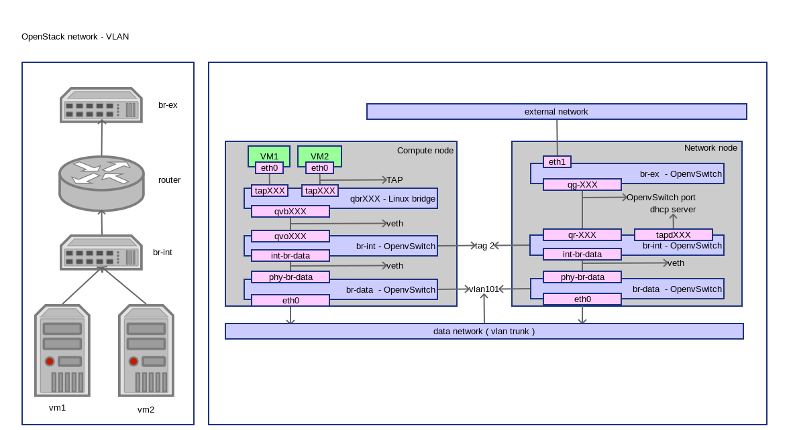

========================
OpenStack Network - VLAN
========================
:Author: Yugang LIU <liuyug@gmail.com>
:Copyright: `署名-相同方式共享 3.0 (CC BY-SA 3.0) <http://creativecommons.org/licenses/by-sa/3.0/>`_

.. section-numbering::
.. contents::

OpenStack VLAN 网络配置详解

其它相关文件请查阅 SimpleStack_

.. _SimpleStack: https://github.com/liuyug/simplestack

Configure network
----------------------
::

    sh gre_settings.sh

.. include:: vlan_settings.sh
    :code: bash

Create external network
------------------------
::

    sh create_ext-net.sh

.. include:: create_ext-net.sh
    :code: bash

Create internal network
------------------------
::

    sh create_int-net.sh

.. include:: create_int-net.sh
    :code: bash

Create VM
-----------
::

    sh tools/create_vm.sh cirros01 cirros-x86_64 demo-net

connect to VM through vnc::

    nova get-vnc-console cirros01

Check network
--------------
compute node
~~~~~~~~~~~~~

ovs-vsctl show::

    1a002d63-3057-49fe-be40-44562e01a6e8
        Bridge br-data
            Port "eth0"
                Interface "eth0"
            Port phy-br-data
                Interface phy-br-data
            Port br-data
                Interface br-data
                    type: internal
        Bridge br-int
            Port br-int
                Interface br-int
                    type: internal
            Port int-br-data
                Interface int-br-data
            Port "qvo53842d98-5a"
                tag: 2
                Interface "qvo53842d98-5a"
        ovs_version: "2.0.1"

+ br-data 为 Provider Network 桥

``ip link``::

    1: lo: <LOOPBACK,UP,LOWER_UP> mtu 65536 qdisc noqueue state UNKNOWN mode DEFAULT group default 
        link/loopback 00:00:00:00:00:00 brd 00:00:00:00:00:00
    2: eth0: <BROADCAST,MULTICAST,UP,LOWER_UP> mtu 1500 qdisc pfifo_fast master ovs-system state UP mode DEFAULT group default qlen 1000
        link/ether 00:21:cc:6d:53:8d brd ff:ff:ff:ff:ff:ff
    3: wlan0: <BROADCAST,MULTICAST> mtu 1500 qdisc noop state DOWN mode DEFAULT group default qlen 1000
        link/ether 08:11:96:5e:48:d8 brd ff:ff:ff:ff:ff:ff
    4: ovs-system: <BROADCAST,MULTICAST> mtu 1500 qdisc noop state DOWN mode DEFAULT group default 
        link/ether c2:9e:63:0d:54:84 brd ff:ff:ff:ff:ff:ff
    5: br-int: <BROADCAST,UP,LOWER_UP> mtu 1500 qdisc noqueue state UNKNOWN mode DEFAULT group default 
        link/ether ba:c3:07:ae:95:46 brd ff:ff:ff:ff:ff:ff
    6: br-data: <BROADCAST,UP,LOWER_UP> mtu 1500 qdisc noqueue state UNKNOWN mode DEFAULT group default 
        link/ether 00:21:cc:6d:53:8d brd ff:ff:ff:ff:ff:ff
    7: virbr0: <NO-CARRIER,BROADCAST,MULTICAST,UP> mtu 1500 qdisc noqueue state DOWN mode DEFAULT group default 
        link/ether 6e:35:a0:75:03:77 brd ff:ff:ff:ff:ff:ff
    18: phy-br-data: <BROADCAST,MULTICAST,UP,LOWER_UP> mtu 1500 qdisc pfifo_fast master ovs-system state UP mode DEFAULT group default qlen 1000
        link/ether ba:f1:a2:cc:94:9a brd ff:ff:ff:ff:ff:ff
    19: int-br-data: <BROADCAST,MULTICAST,UP,LOWER_UP> mtu 1500 qdisc pfifo_fast master ovs-system state UP mode DEFAULT group default qlen 1000
        link/ether da:0b:45:78:0e:3c brd ff:ff:ff:ff:ff:ff
    20: qbr53842d98-5a: <BROADCAST,MULTICAST,UP,LOWER_UP> mtu 1500 qdisc noqueue state UP mode DEFAULT group default 
        link/ether 2e:3f:1a:8a:e6:6d brd ff:ff:ff:ff:ff:ff
    21: qvo53842d98-5a: <BROADCAST,MULTICAST,PROMISC,UP,LOWER_UP> mtu 1500 qdisc pfifo_fast master ovs-system state UP mode DEFAULT group default qlen 1000
        link/ether 2e:aa:39:0c:da:da brd ff:ff:ff:ff:ff:ff
    22: qvb53842d98-5a: <BROADCAST,MULTICAST,PROMISC,UP,LOWER_UP> mtu 1500 qdisc pfifo_fast master qbr53842d98-5a state UP mode DEFAULT group default qlen 1000
        link/ether 2e:3f:1a:8a:e6:6d brd ff:ff:ff:ff:ff:ff
    23: tap53842d98-5a: <BROADCAST,MULTICAST,UP,LOWER_UP> mtu 1500 qdisc pfifo_fast master qbr53842d98-5a state UNKNOWN mode DEFAULT group default qlen 500
        link/ether fe:16:3e:93:ea:46 brd ff:ff:ff:ff:ff:ff

``brctl show``::

    bridge name	bridge id		STP enabled	interfaces
    qbr53842d98-5a		8000.2e3f1a8ae66d	no		qvb53842d98-5a
                                tap53842d98-5a

``virsh list``::

     Id    Name                           State
    ----------------------------------------------------
     2     instance-00000045              running

``virsh dumpxml instance-00000045 | grep tap``::

      <target dev='tap53842d98-5a'/>

+ VM 使用接口 tap53842d98-5a
+ tap53842d98-5a 和 qvb53842d98-5a 在桥 qbr53842d98-5a 里

``ethtool -S qvb53842d98-5a``::

    NIC statistics:
         peer_ifindex: 21

    # from ip link
    # 21: qvo53842d98-5a: <BROADCAST,MULTICAST,PROMISC,UP,LOWER_UP> mtu 1500 qdisc pfifo_fast master ovs-system state UP mode DEFAULT group default qlen 1000
        link/ether 2e:aa:39:0c:da:da brd ff:ff:ff:ff:ff:ff

``ethtool -S qvo53842d98-5a``::

    NIC statistics:
         peer_ifindex: 22

    # from ip link
    # 22: qvb53842d98-5a: <BROADCAST,MULTICAST,PROMISC,UP,LOWER_UP> mtu 1500 qdisc pfifo_fast master qbr53842d98-5a state UP mode DEFAULT group default qlen 1000
        link/ether 2e:3f:1a:8a:e6:6d brd ff:ff:ff:ff:ff:ff

+ qvb53842d98-5a 和 qvo53842d98-5a 是一对 veth

``ethtool -S int-br-data``::

    NIC statistics:
         peer_ifindex: 18

    # 18: phy-br-data: <BROADCAST,MULTICAST,UP,LOWER_UP> mtu 1500 qdisc pfifo_fast master ovs-system state UP mode DEFAULT group default qlen 1000
        link/ether ba:f1:a2:cc:94:9a brd ff:ff:ff:ff:ff:ff

``ethtool -S phy-br-data``::

    NIC statistics:
         peer_ifindex: 19

    # 19: int-br-data: <BROADCAST,MULTICAST,UP,LOWER_UP> mtu 1500 qdisc pfifo_fast master ovs-system state UP mode DEFAULT group default qlen 1000
        link/ether da:0b:45:78:0e:3c brd ff:ff:ff:ff:ff:ff

+ int-br-data 和 phy-br-data 是一对 veth
+ qvo53842d98-5a 通过 int-br-data, phy-br-data 到达 br-data
+ br-data 通过 eth0 到达网络节点的 br-data

network node
~~~~~~~~~~~~~

``ovs-vsctl show``::

    8108a40e-292b-4ed0-80c1-23fc08aacd3d
        Bridge br-int
            Port "qr-661a1f84-a9"
                tag: 2
                Interface "qr-661a1f84-a9"
                    type: internal
            Port int-br-data
                Interface int-br-data
            Port "tapd02e5cd0-3d"
                tag: 2
                Interface "tapd02e5cd0-3d"
                    type: internal
            Port br-int
                Interface br-int
                    type: internal
        Bridge br-ex
            Port br-ex
                Interface br-ex
                    type: internal
            Port "qg-489acfeb-f3"
                Interface "qg-489acfeb-f3"
                    type: internal
        Bridge br-data
            Port br-data
                Interface br-data
                    type: internal
            Port "eth0"
                Interface "eth0"
            Port phy-br-data
                Interface phy-br-data
        ovs_version: "2.0.1"

``ip netns``::

    qdhcp-8e5d7726-954e-4435-bce1-54e3fc78fe3a
    qrouter-558570d9-ae7e-4584-8999-9e74bdc8a57d

``ip netns exec qdhcp-8e5d7726-954e-4435-bce1-54e3fc78fe3a ip link``::

    1: lo: <LOOPBACK,UP,LOWER_UP> mtu 65536 qdisc noqueue state UNKNOWN mode DEFAULT group default 
        link/loopback 00:00:00:00:00:00 brd 00:00:00:00:00:00
    43: tapd02e5cd0-3d: <BROADCAST,UP,LOWER_UP> mtu 1500 qdisc noqueue state UNKNOWN mode DEFAULT group default 
        link/ether fa:16:3e:11:05:f2 brd ff:ff:ff:ff:ff:ff

``ps -ef | grep dns``::

    nobody   15723     1  0 10:32 ?        00:00:00 dnsmasq --no-hosts --no-resolv --strict-order --bind-interfaces --interface=tapd02e5cd0-3d --except-interface=lo --pid-file=/var/lib/neutron/dhcp/8e5d7726-954e-4435-bce1-54e3fc78fe3a/pid --dhcp-hostsfile=/var/lib/neutron/dhcp/8e5d7726-954e-4435-bce1-54e3fc78fe3a/host --addn-hosts=/var/lib/neutron/dhcp/8e5d7726-954e-4435-bce1-54e3fc78fe3a/addn_hosts --dhcp-optsfile=/var/lib/neutron/dhcp/8e5d7726-954e-4435-bce1-54e3fc78fe3a/opts --leasefile-ro --dhcp-range=set:tag0,10.0.1.0,static,86400s --dhcp-lease-max=16 --conf-file= --domain=openstacklocal
    root     21245 16601  0 11:13 pts/10   00:00:00 grep --color=auto dns

+ tapd02e5cd0-3d 接口上是 DHCP 服务

``ip netns exec qrouter-59d2cc28-b4ab-4c54-9208-7fb899445278 ip link``::

    1: lo: <LOOPBACK,UP,LOWER_UP> mtu 65536 qdisc noqueue state UNKNOWN mode DEFAULT group default 
        link/loopback 00:00:00:00:00:00 brd 00:00:00:00:00:00
    105: qr-a45cd9b5-4b: <BROADCAST,UP,LOWER_UP> mtu 1500 qdisc noqueue state UNKNOWN mode DEFAULT group default 
        link/ether fa:16:3e:76:78:d1 brd ff:ff:ff:ff:ff:ff
    106: qg-0baef12f-d3: <BROADCAST,UP,LOWER_UP> mtu 1500 qdisc noqueue state UNKNOWN mode DEFAULT group default 
        link/ether fa:16:3e:a2:79:9e brd ff:ff:ff:ff:ff:ff

``ip netns exec qrouter-558570d9-ae7e-4584-8999-9e74bdc8a57d ip route``::

    default via 192.168.1.1 dev qg-489acfeb-f3
    192.168.1.0/24 dev qg-489acfeb-f3  proto kernel  scope link  src 192.168.1.245
    10.0.1.0/28 dev qr-661a1f84-a9  proto kernel  scope link  src 10.0.1.1 

+ qr-XXX 和 qg-XXX 两个接口被路由

``ip netns exec qrouter-558570d9-ae7e-4584-8999-9e74bdc8a57d iptables -S``::

    -P INPUT ACCEPT
    -P FORWARD ACCEPT
    -P OUTPUT ACCEPT
    -N neutron-filter-top
    -N neutron-l3-agent-FORWARD
    -N neutron-l3-agent-INPUT
    -N neutron-l3-agent-OUTPUT
    -N neutron-l3-agent-local
    -A INPUT -j neutron-l3-agent-INPUT
    -A FORWARD -j neutron-filter-top
    -A FORWARD -j neutron-l3-agent-FORWARD
    -A OUTPUT -j neutron-filter-top
    -A OUTPUT -j neutron-l3-agent-OUTPUT
    -A neutron-filter-top -j neutron-l3-agent-local
    -A neutron-l3-agent-INPUT -d 127.0.0.1/32 -p tcp -m tcp --dport 9697 -j ACCEPT

``ip netns exec qrouter-558570d9-ae7e-4584-8999-9e74bdc8a57d iptables -t nat -S``::

    -P PREROUTING ACCEPT
    -P INPUT ACCEPT
    -P OUTPUT ACCEPT
    -P POSTROUTING ACCEPT
    -N neutron-l3-agent-OUTPUT
    -N neutron-l3-agent-POSTROUTING
    -N neutron-l3-agent-PREROUTING
    -N neutron-l3-agent-float-snat
    -N neutron-l3-agent-snat
    -N neutron-postrouting-bottom
    -A PREROUTING -j neutron-l3-agent-PREROUTING
    -A OUTPUT -j neutron-l3-agent-OUTPUT
    -A POSTROUTING -j neutron-l3-agent-POSTROUTING
    -A POSTROUTING -j neutron-postrouting-bottom
    -A neutron-l3-agent-POSTROUTING ! -i qg-489acfeb-f3 ! -o qg-489acfeb-f3 -m conntrack ! --ctstate DNAT -j ACCEPT
    -A neutron-l3-agent-PREROUTING -d 169.254.169.254/32 -p tcp -m tcp --dport 80 -j REDIRECT --to-ports 9697
    -A neutron-l3-agent-snat -j neutron-l3-agent-float-snat
    -A neutron-l3-agent-snat -s 10.0.1.0/28 -j SNAT --to-source 192.168.1.245
    -A neutron-postrouting-bottom -j neutron-l3-agent-snat

+ 访问 169.254.169.254:80 将被转发到 169.254.169.254:9697
+ 从 10.0.1.0 出发的包，源地址变成 192.168.1.245。VM 通过地址转换可以访问外网

``ip netns exec qrouter-558570d9-ae7e-4584-8999-9e74bdc8a57d  netstat -tunlp``::

    Active Internet connections (only servers)
    Proto Recv-Q Send-Q Local Address           Foreign Address         State       PID/Program name
    tcp        0      0 0.0.0.0:9697            0.0.0.0:*               LISTEN      14989/python

``ps -ef | grep 14989``::

    root     14989     1  0 10:29 ?        00:00:00 /usr/bin/python /usr/bin/neutron-ns-metadata-proxy --pid_file=/var/lib/neutron/external/pids/558570d9-ae7e-4584-8999-9e74bdc8a57d.pid --metadata_proxy_socket=/var/lib/neutron/metadata_proxy --router_id=558570d9-ae7e-4584-8999-9e74bdc8a57d --state_path=/var/lib/neutron --metadata_port=9697 --verbose --log-file=neutron-ns-metadata-proxy-558570d9-ae7e-4584-8999-9e74bdc8a57d.log --log-dir=/var/log/neutron
    root     23921 16601  0 11:32 pts/10   00:00:00 grep --color=auto 14989

+ 9697 端口是 Neutron Metadata agent

OpenFlow
~~~~~~~~~
``ovs-ofctl dump-flows br-int``::

    NXST_FLOW reply (xid=0x4):
     cookie=0x0, duration=1352.852s, table=0, n_packets=160, n_bytes=15509, idle_age=622, priority=3,in_port=1,dl_vlan=101 actions=mod_vlan_vid:2,NORMAL
     cookie=0x0, duration=1956.322s, table=0, n_packets=15, n_bytes=1162, idle_age=1941, priority=2,in_port=1 actions=drop
     cookie=0x0, duration=1956.778s, table=0, n_packets=194, n_bytes=23425, idle_age=620, priority=1 actions=NORMAL

+ 将 vlan101 的更改为 vlan2，其他的丢弃
+ br-int 上 接口 tag 是 2

``ovs-ofctl dump-flows br-data``::

    NXST_FLOW reply (xid=0x4):
     cookie=0x0, duration=1349.094s, table=0, n_packets=118, n_bytes=16517, idle_age=617, priority=4,in_port=2,dl_vlan=2 actions=mod_vlan_vid:101,NORMAL
     cookie=0x0, duration=1952.474s, table=0, n_packets=34, n_bytes=2848, idle_age=1215, priority=2,in_port=2 actions=drop
     cookie=0x0, duration=1952.883s, table=0, n_packets=4850, n_bytes=1305999, idle_age=1, priority=1 actions=NORMAL

+ 将 vlan2 更改为 vlan101，其他的丢弃
+ br-data 上都是 vlan101，所以相连接的交换机必须允许vlan101通过

``ovs-ofctl dump-flows br-ex``::

    NXST_FLOW reply (xid=0x4):
     cookie=0x0, duration=1963.865s, table=0, n_packets=74, n_bytes=4180, idle_age=624, priority=0 actions=NORMAL

