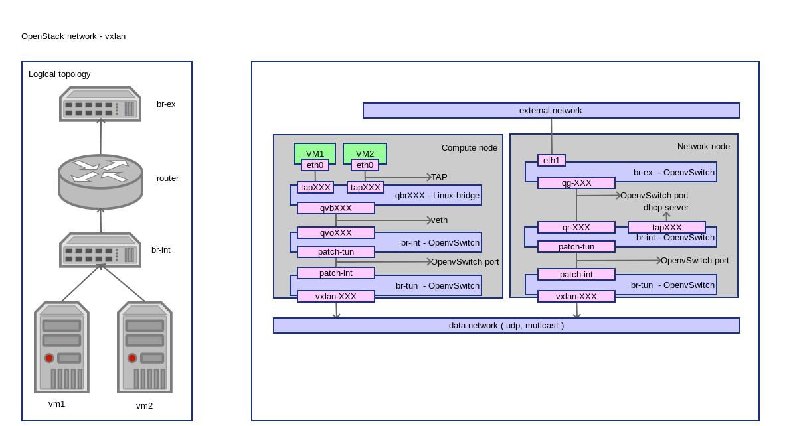

OpenStack Network - vxlan
===========================
:Author: Yugang LIU <liuyug@gmail.com>
:Copyright: `署名-相同方式共享 3.0 (CC BY-SA 3.0) <http://creativecommons.org/licenses/by-sa/3.0/>`_

.. section-numbering::
.. contents::

OpenStack vxlan 网络配置详解

其它相关文件请查阅我的 SimpleStack_

.. _SimpleStack: https://github.com/liuyug/simplestack

Configure network
----------------------
::

    sh vxlan_settings.sh

.. include:: vxlan_settings.sh
    :code: bash

Create external network
------------------------
::

    sh create_ext-net.sh

.. include:: create_ext-net.sh
    :code: bash

Create internal network
------------------------
::

    sh create_int-net.sh

.. include:: create_int-net.sh
    :code: bash

Create VM
-----------
::

    sh tools/create_vm.sh cirros01 cirros-x86_64 demo-net

connect to VM through vnc::

    nova get-vnc-console cirros01

Check network
--------------
compute node
~~~~~~~~~~~~~~

ovs-vsctl show::

    1a002d63-3057-49fe-be40-44562e01a6e8
        Bridge br-int
            Port patch-tun
                Interface patch-tun
                    type: patch
                    options: {peer=patch-int}
            Port "qvo081fc401-04"
                tag: 1
                Interface "qvo081fc401-04"
            Port br-int
                Interface br-int
                    type: internal
        Bridge br-tun
            Port "vxlan-c0a86465"
                Interface "vxlan-c0a86465"
                    type: vxlan
                    options: {in_key=flow, local_ip="192.168.100.100", out_key=flow, remote_ip="192.168.100.101"}
            Port br-tun
                Interface br-tun
                    type: internal
            Port patch-int
                Interface patch-int
                    type: patch
                    options: {peer=patch-tun}
        ovs_version: "2.0.1"

+ br-tun 为 vxlan Tunnel 桥

``ip link``::

    1: lo: <LOOPBACK,UP,LOWER_UP> mtu 65536 qdisc noqueue state UNKNOWN mode DEFAULT group default 
        link/loopback 00:00:00:00:00:00 brd 00:00:00:00:00:00
    2: eth0: <BROADCAST,MULTICAST,UP,LOWER_UP> mtu 1500 qdisc pfifo_fast state UP mode DEFAULT group default qlen 1000
        link/ether 00:21:cc:6d:53:8d brd ff:ff:ff:ff:ff:ff
    3: wlan0: <BROADCAST,MULTICAST,UP,LOWER_UP> mtu 1500 qdisc mq state UP mode DORMANT group default qlen 1000
        link/ether 08:11:96:5e:48:d8 brd ff:ff:ff:ff:ff:ff
    4: ovs-system: <BROADCAST,MULTICAST> mtu 1500 qdisc noop state DOWN mode DEFAULT group default 
        link/ether de:9d:07:b4:3f:4b brd ff:ff:ff:ff:ff:ff
    5: br-int: <BROADCAST,UP,LOWER_UP> mtu 1500 qdisc noqueue state UNKNOWN mode DEFAULT group default 
        link/ether ba:c3:07:ae:95:46 brd ff:ff:ff:ff:ff:ff
    7: virbr0: <NO-CARRIER,BROADCAST,MULTICAST,UP> mtu 1500 qdisc noqueue state DOWN mode DEFAULT group default 
        link/ether 62:03:36:dc:3d:d5 brd ff:ff:ff:ff:ff:ff
    19: br-tun: <BROADCAST,UP,LOWER_UP> mtu 1500 qdisc noqueue state UNKNOWN mode DEFAULT group default 
        link/ether ea:83:a1:e0:dc:4a brd ff:ff:ff:ff:ff:ff
    20: qbr081fc401-04: <BROADCAST,MULTICAST,UP,LOWER_UP> mtu 1500 qdisc noqueue state UP mode DEFAULT group default 
        link/ether e2:4b:c7:7e:1c:bd brd ff:ff:ff:ff:ff:ff
    21: qvo081fc401-04: <BROADCAST,MULTICAST,PROMISC,UP,LOWER_UP> mtu 1500 qdisc pfifo_fast master ovs-system state UP mode DEFAULT group default qlen 1000
        link/ether 9e:58:79:aa:61:32 brd ff:ff:ff:ff:ff:ff
    22: qvb081fc401-04: <BROADCAST,MULTICAST,PROMISC,UP,LOWER_UP> mtu 1500 qdisc pfifo_fast master qbr081fc401-04 state UP mode DEFAULT group default qlen 1000
        link/ether e2:4b:c7:7e:1c:bd brd ff:ff:ff:ff:ff:ff
    23: tap081fc401-04: <BROADCAST,MULTICAST,UP,LOWER_UP> mtu 1500 qdisc pfifo_fast master qbr081fc401-04 state UNKNOWN mode DEFAULT group default qlen 500
        link/ether fe:16:3e:f0:1b:35 brd ff:ff:ff:ff:ff:ff

``brctl show``::

    bridge name	bridge id		STP enabled	interfaces
    qbr081fc401-04		8000.e24bc77e1cbd	no		qvb081fc401-04
                                tap081fc401-04

``virsh list``::

     Id    Name                           State
    ----------------------------------------------------
     2     instance-0000004d              running

``virsh dumpxml instance-0000004d | grep tap``::

      <target dev='tap081fc401-04'/>

+ VM 使用接口 tap081fc401-04
+ tap081fc401-04 和 qvb081fc401-04 在桥 qbr081fc401-04 里

``ethtool -S qvb081fc401-04``::

    NIC statistics:
         peer_ifindex: 21

``ethtool -S qvo081fc401-04``::

    NIC statistics:
         peer_ifindex: 22

+ qvb081fc401-04 和 qvo081fc401-04 是一对 veth
+ qvb081fc401-04 通过 patch-tun, patch-int 到达 br-tun
+ br-tun 通过 vxlan-c0a86465, vxlan-c0a86464 到达网络节点的 br-tun

network node
~~~~~~~~~~~~~

``ovs-vsctl show``::

    8108a40e-292b-4ed0-80c1-23fc08aacd3d
        Bridge br-ex
            Port "qg-070a05ab-ca"
                Interface "qg-070a05ab-ca"
                    type: internal
            Port br-ex
                Interface br-ex
                    type: internal
        Bridge br-int
            Port "qr-cdb08767-c6"
                tag: 1
                Interface "qr-cdb08767-c6"
                    type: internal
            Port "tap168bb8f2-fa"
                tag: 1
                Interface "tap168bb8f2-fa"
                    type: internal
            Port br-int
                Interface br-int
                    type: internal
            Port patch-tun
                Interface patch-tun
                    type: patch
                    options: {peer=patch-int}
        Bridge br-tun
            Port br-tun
                Interface br-tun
                    type: internal
            Port patch-int
                Interface patch-int
                    type: patch
                    options: {peer=patch-tun}
            Port "vxlan-c0a86464"
                Interface "vxlan-c0a86464"
                    type: vxlan
                    options: {in_key=flow, local_ip="192.168.100.101", out_key=flow, remote_ip="192.168.100.100"}
        ovs_version: "2.0.1"

``ip netns``::

    qdhcp-bc152586-b6aa-4ee4-9851-739f46852e7a
    qrouter-8541b578-885d-405d-b70c-99a15a57d0e3

``ip netns exec qdhcp-bc152586-b6aa-4ee4-9851-739f46852e7a ip link``::

    1: lo: <LOOPBACK,UP,LOWER_UP> mtu 65536 qdisc noqueue state UNKNOWN mode DEFAULT group default 
        link/loopback 00:00:00:00:00:00 brd 00:00:00:00:00:00
    50: tap168bb8f2-fa: <BROADCAST,UP,LOWER_UP> mtu 1500 qdisc noqueue state UNKNOWN mode DEFAULT group default 
        link/ether fa:16:3e:53:ea:b5 brd ff:ff:ff:ff:ff:ff

``ps -ef | grep dns``::

    nobody   21482     1  0 15:17 ?        00:00:00 dnsmasq --no-hosts --no-resolv --strict-order --bind-interfaces --interface=tap168bb8f2-fa --except-interface=lo --pid-file=/var/lib/neutron/dhcp/bc152586-b6aa-4ee4-9851-739f46852e7a/pid --dhcp-hostsfile=/var/lib/neutron/dhcp/bc152586-b6aa-4ee4-9851-739f46852e7a/host --addn-hosts=/var/lib/neutron/dhcp/bc152586-b6aa-4ee4-9851-739f46852e7a/addn_hosts --dhcp-optsfile=/var/lib/neutron/dhcp/bc152586-b6aa-4ee4-9851-739f46852e7a/opts --leasefile-ro --dhcp-range=set:tag0,10.0.1.0,static,86400s --dhcp-lease-max=16 --conf-file= --domain=openstacklocal
    root     24123  1360  0 15:51 pts/7    00:00:00 grep --color=auto dns

+ tap168bb8f2-fa 接口上是 DHCP 服务

``ip netns exec qrouter-8541b578-885d-405d-b70c-99a15a57d0e3 ip link``::

    1: lo: <LOOPBACK,UP,LOWER_UP> mtu 65536 qdisc noqueue state UNKNOWN mode DEFAULT group default 
        link/loopback 00:00:00:00:00:00 brd 00:00:00:00:00:00
    48: qr-cdb08767-c6: <BROADCAST,UP,LOWER_UP> mtu 1500 qdisc noqueue state UNKNOWN mode DEFAULT group default 
        link/ether fa:16:3e:f9:33:e6 brd ff:ff:ff:ff:ff:ff
    49: qg-070a05ab-ca: <BROADCAST,UP,LOWER_UP> mtu 1500 qdisc noqueue state UNKNOWN mode DEFAULT group default 
        link/ether fa:16:3e:9c:9b:68 brd ff:ff:ff:ff:ff:ff

``ip netns exec qrouter-8541b578-885d-405d-b70c-99a15a57d0e3 ip route``::

    default via 192.168.200.1 dev qg-070a05ab-ca 
    10.0.1.0/28 dev qr-cdb08767-c6  proto kernel  scope link  src 10.0.1.1 
    192.168.200.0/24 dev qg-070a05ab-ca  proto kernel  scope link  src 192.168.200.150 

+ qr-XXX 和 qg-XXX 两个接口被路由

``ip netns exec qrouter-8541b578-885d-405d-b70c-99a15a57d0e3 iptables -S``::

    -P INPUT ACCEPT
    -P FORWARD ACCEPT
    -P OUTPUT ACCEPT
    -N neutron-filter-top
    -N neutron-l3-agent-FORWARD
    -N neutron-l3-agent-INPUT
    -N neutron-l3-agent-OUTPUT
    -N neutron-l3-agent-local
    -A INPUT -j neutron-l3-agent-INPUT
    -A FORWARD -j neutron-filter-top
    -A FORWARD -j neutron-l3-agent-FORWARD
    -A OUTPUT -j neutron-filter-top
    -A OUTPUT -j neutron-l3-agent-OUTPUT
    -A neutron-filter-top -j neutron-l3-agent-local
    -A neutron-l3-agent-INPUT -d 127.0.0.1/32 -p tcp -m tcp --dport 9697 -j ACCEPT

``ip netns exec qrouter-8541b578-885d-405d-b70c-99a15a57d0e3 iptables -t nat -S``::

    -P PREROUTING ACCEPT
    -P INPUT ACCEPT
    -P OUTPUT ACCEPT
    -P POSTROUTING ACCEPT
    -N neutron-l3-agent-OUTPUT
    -N neutron-l3-agent-POSTROUTING
    -N neutron-l3-agent-PREROUTING
    -N neutron-l3-agent-float-snat
    -N neutron-l3-agent-snat
    -N neutron-postrouting-bottom
    -A PREROUTING -j neutron-l3-agent-PREROUTING
    -A OUTPUT -j neutron-l3-agent-OUTPUT
    -A POSTROUTING -j neutron-l3-agent-POSTROUTING
    -A POSTROUTING -j neutron-postrouting-bottom
    -A neutron-l3-agent-POSTROUTING ! -i qg-070a05ab-ca ! -o qg-070a05ab-ca -m conntrack ! --ctstate DNAT -j ACCEPT
    -A neutron-l3-agent-PREROUTING -d 169.254.169.254/32 -p tcp -m tcp --dport 80 -j REDIRECT --to-ports 9697
    -A neutron-l3-agent-snat -j neutron-l3-agent-float-snat
    -A neutron-l3-agent-snat -s 10.0.1.0/28 -j SNAT --to-source 192.168.200.150
    -A neutron-postrouting-bottom -j neutron-l3-agent-snat

+ 访问 169.254.169.254:80 将被转发到 169.254.169.254:9697
+ 从 10.0.1.0 出发的包，源地址变成 192.168.200.150。VM 通过地址转换可以访问外网

``ip netns exec qrouter-8541b578-885d-405d-b70c-99a15a57d0e3 netstat -tunlp``::

    Active Internet connections (only servers)
    Proto Recv-Q Send-Q Local Address           Foreign Address         State       PID/Program name
    tcp        0      0 0.0.0.0:9697            0.0.0.0:*               LISTEN      20971/python 

``ps -ef | grep 20971``::

    root     20971     1  0 15:16 ?        00:00:00 /usr/bin/python /usr/bin/neutron-ns-metadata-proxy --pid_file=/var/lib/neutron/external/pids/8541b578-885d-405d-b70c-99a15a57d0e3.pid --metadata_proxy_socket=/var/lib/neutron/metadata_proxy --router_id=8541b578-885d-405d-b70c-99a15a57d0e3 --state_path=/var/lib/neutron --metadata_port=9697 --verbose --log-file=neutron-ns-metadata-proxy-8541b578-885d-405d-b70c-99a15a57d0e3.log --log-dir=/var/log/neutron
    root     24399  1360  0 15:56 pts/7    00:00:00 grep --color=auto 20971

+ 9697 端口是 Neutron Metadata agent

OpenFlow
~~~~~~~~~
``ovs-ofctl dump-flows br-int``::

    NXST_FLOW reply (xid=0x4):
     cookie=0x0, duration=2673.242s, table=0, n_packets=203, n_bytes=20767, idle_age=2240, priority=1 actions=NORMAL

``ovs-ofctl dump-flows br-tun``::

    NXST_FLOW reply (xid=0x4):
     cookie=0x0, duration=2689.385s, table=0, n_packets=89, n_bytes=9564, idle_age=2256, priority=1,in_port=1 actions=resubmit(,1)
     cookie=0x0, duration=2688.545s, table=0, n_packets=113, n_bytes=11113, idle_age=2259, priority=1,in_port=2 actions=resubmit(,3)
     cookie=0x0, duration=2689.328s, table=0, n_packets=6, n_bytes=468, idle_age=2679, priority=0 actions=drop
     cookie=0x0, duration=2689.271s, table=1, n_packets=71, n_bytes=8088, idle_age=2256, priority=1,dl_dst=00:00:00:00:00:00/01:00:00:00:00:00 actions=resubmit(,20)
     cookie=0x0, duration=2689.217s, table=1, n_packets=18, n_bytes=1476, idle_age=2340, priority=1,dl_dst=01:00:00:00:00:00/01:00:00:00:00:00 actions=resubmit(,21)
     cookie=0x0, duration=2689.162s, table=2, n_packets=0, n_bytes=0, idle_age=2689, priority=0 actions=drop
     cookie=0x0, duration=2429.691s, table=3, n_packets=113, n_bytes=11113, idle_age=2259, priority=1,tun_id=0x2 actions=mod_vlan_vid:1,resubmit(,10)
     cookie=0x0, duration=2689.107s, table=3, n_packets=0, n_bytes=0, idle_age=2689, priority=0 actions=drop
     cookie=0x0, duration=2689.051s, table=10, n_packets=113, n_bytes=11113, idle_age=2259, priority=1 actions=learn(table=20,hard_timeout=300,priority=1,NXM_OF_VLAN_TCI[0..11],NXM_OF_ETH_DST[]=NXM_OF_ETH_SRC[],load:0->NXM_OF_VLAN_TCI[],load:NXM_NX_TUN_ID[]->NXM_NX_TUN_ID[],output:NXM_OF_IN_PORT[]),output:1
     cookie=0x0, duration=2688.997s, table=20, n_packets=0, n_bytes=0, idle_age=2688, priority=0 actions=resubmit(,21)
     cookie=0x0, duration=2429.746s, table=21, n_packets=9, n_bytes=710, idle_age=2340, dl_vlan=1 actions=strip_vlan,set_tunnel:0x2,output:2
     cookie=0x0, duration=2688.94s, table=21, n_packets=9, n_bytes=766, idle_age=2349, priority=0 actions=drop

+ 更改 tunnel 2 的包为 vlan1
+ vlan1 的包去除 vlan 标记，并设置 tunnel 标记为 2
+ vxlan 上的数据被 UDP 封装

``ovs-ofctl dump-flows br-ex``::

    NXST_FLOW reply (xid=0x4):
     cookie=0x0, duration=2716.849s, table=0, n_packets=18, n_bytes=1116, idle_age=2283, priority=0 actions=NORMAL

Package check
-------------
``tcpdump -ne -vv  -i eth0``::

    tcpdump: listening on eth0, link-type EN10MB (Ethernet), capture size 65535 bytes
    16:09:54.188424 00:21:cc:6d:53:8d > f0:de:f1:0e:be:e3, ethertype IPv4 (0x0800), length 148: (tos 0x0, ttl 64, id 30343, offset 0, flags [DF], proto UDP (17), length 134)
        192.168.100.100.48077 > 192.168.100.101.4789: [no cksum] VXLAN, flags [I] (0x08), vni 2
    fa:16:3e:f0:1b:35 > fa:16:3e:f9:33:e6, ethertype IPv4 (0x0800), length 98: (tos 0x0, ttl 64, id 42757, offset 0, flags [DF], proto ICMP (1), length 84)
        10.0.1.2 > 192.168.200.1: ICMP echo request, id 18945, seq 527, length 64
    16:09:54.188528 f0:de:f1:0e:be:e3 > 00:21:cc:6d:53:8d, ethertype IPv4 (0x0800), length 148: (tos 0x0, ttl 64, id 6008, offset 0, flags [DF], proto UDP (17), length 134)
        192.168.100.101.49586 > 192.168.100.100.4789: [no cksum] VXLAN, flags [I] (0x08), vni 2
    fa:16:3e:f9:33:e6 > fa:16:3e:f0:1b:35, ethertype IPv4 (0x0800), length 98: (tos 0x0, ttl 63, id 23187, offset 0, flags [none], proto ICMP (1), length 84)
        192.168.200.1 > 10.0.1.2: ICMP echo reply, id 18945, seq 527, length 64

+ 从 VM ping 外网地址，监听 eth0 上的 vxlan 通道。所截获的包都是 UDP，vxlan
